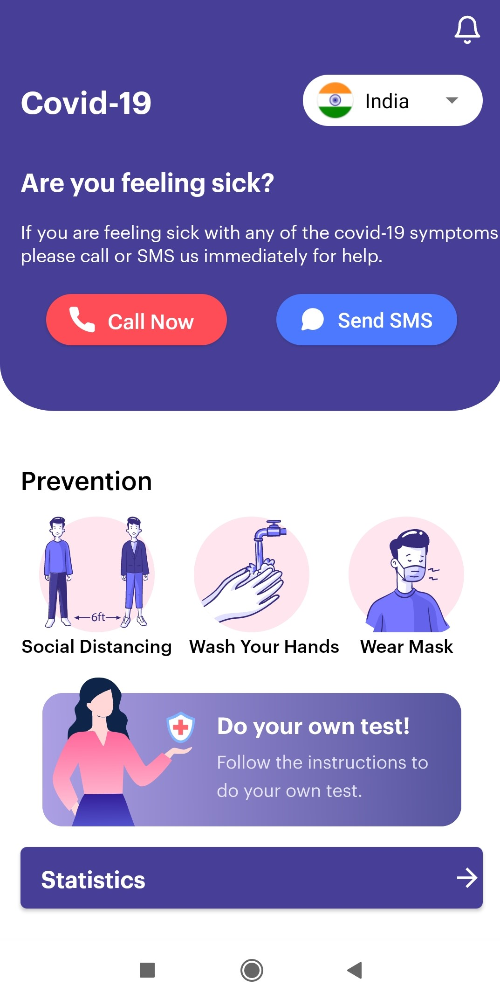
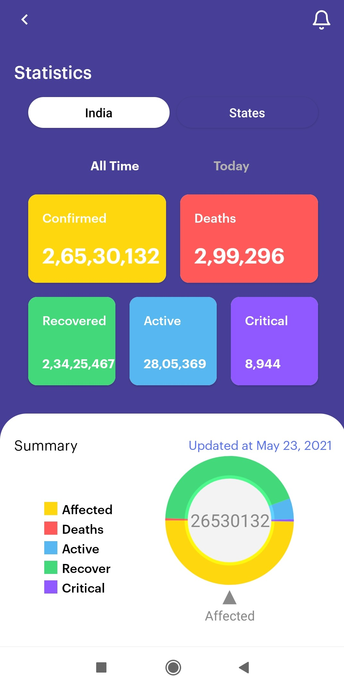
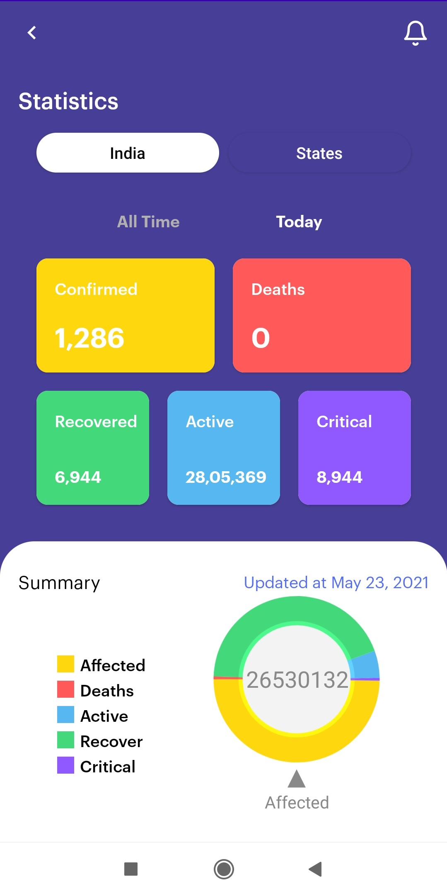
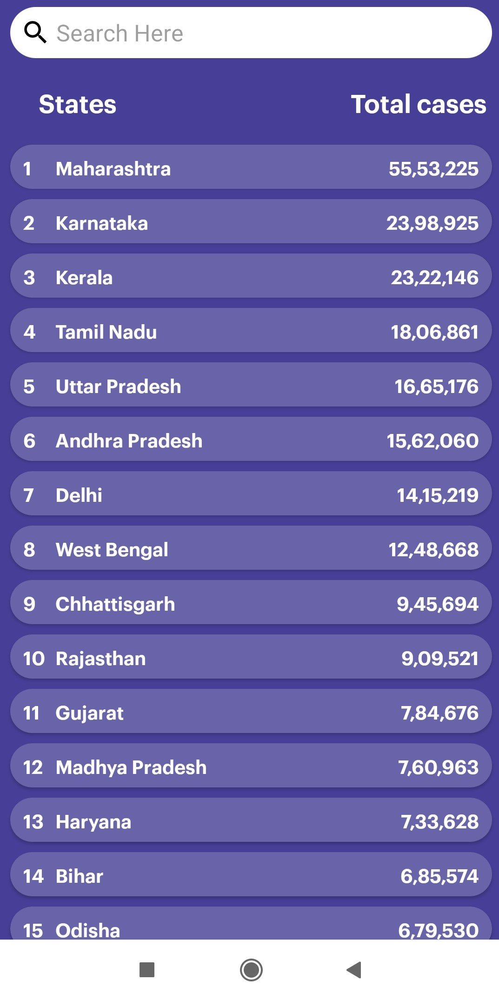
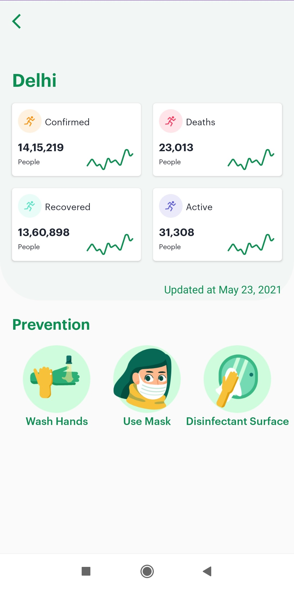

# Covid-19 Tracker
Download the app from https://drive.google.com/file/d/1cH62cUyRDzKsTwmz2wyEBzMDgSpHCQWV/view

## About
Built an Android App using Java with the functionality to track the spread of novel Corona Virus (COVID-19) in 11 different Countries around the world and all states in India using REST API and Retrofit library.

## Permission
On Android versions prior to Android 6.0, this ChatApp requires the following permissions:
- Full Network Access.
- Access to messaging.
- Access to Dialer.
- Run at startup.
- Read and write access to external storage.

## Libraries this app use
- Retrofit - https://square.github.io/retrofit/
- EazeGraph - https://github.com/blackfizz/EazeGraph
- Gson Converter - https://github.com/square/retrofit/tree/master/retrofit-converters/gson

## Screenshots

